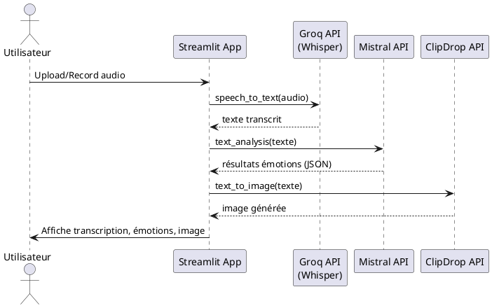

# 🌙 Synthétiseur de Rêve

Une application interactive basée sur Streamlit qui permet d’enregistrer ou uploader un rêve audio, d’en générer automatiquement une **transcription**, une **analyse émotionnelle**, et une **image descriptive** via l’intelligence artificielle.

---

## 🚀 Fonctionnalités

- 🎤 **Enregistrement vocal ou upload audio**
- ✍️ **Transcription automatique** (via Groq + Whisper)
- 📊 **Analyse émotionnelle textuelle** (via Mistral AI)
- 🖼️ **Génération d'image à partir du texte** (via ClipDrop API)
- 📉 **Visualisation interactive** (graphiques + image)

---

## 🛠️ Installation

```bash
git clone https://github.com/votre-utilisateur/synthetiseur-de-reve.git
cd synthetiseur-de-reve
pip install -r requirements.txt
```

### ✅ Variables d’environnement à définir (`.env`)

```
GROQ_API_KEY=xxx
MISTRAL_API_KEY=xxx
CLIPDROP_API_KEY=xxx
```

---

## 🎮 Lancer l'application

```bash
streamlit run frontend.py
```

---

## 📊 Benchmark des APIs

| API / Service        | Coût estimé ($)                                   | Temps de réponse (moyen) | Quota gratuit / Limites    | Conformité RGPD     |
|----------------------|---------------------------------------------------|---------------------------|-----------------------------|----------------------|
| **Groq (Whisper)**   | Gratuit actuellement via Groq                     | ~5-10 sec / audio court   | Illimité actuellement       | 🇺🇸 Non conforme*     |
| **Mistral AI**       | 0,10 €/1k tokens (via API)                        | ~1-2 sec                  | 5€ offerts en test          | 🇫🇷 Conforme          |
| **ClipDrop**         | 1 crédit/image (≈ 0.01 à 0.05 $/image)            | ~2-5 sec / image          | 400 crédits gratuits/mois   | 🇫🇷 Conforme          |
| **streamlit-audiorecorder** | Gratuit (open source)                    | Instantané                | -                           | 🟢 local browser      |

> ℹ️ *Groq utilise des serveurs aux États-Unis. Pour respecter le RGPD, une version locale de Whisper pourrait être utilisée.*

---

## 📐 Diagramme de Séquence (Traitement d’un Rêve)



👉 Ce diagramme illustre le flux complet de données, du rêve audio à l’image générée.

---

## 📁 Structure du projet

```
📦 synthetiseur-de-reve
├── frontend.py              # Interface utilisateur Streamlit
├── main.py                  # Backend : traitement audio / texte / image
├── context_analysis.txt     # Prompt système pour l'analyse émotionnelle
├── .env                     # Variables d’API (non versionné)
├── requirements.txt         # Librairies Python nécessaires
└── README.md                # Documentation projet
```

---

## 👨‍💻 Technologies utilisées

- **Python 3.10+**
- **Streamlit**
- **streamlit-audiorecorder**
- **Mistral AI**
- **Groq Whisper API**
- **ClipDrop API**
- **Plotly**, **PIL**, **dotenv**

---

## 📌 Conseils d’utilisation

- Préférez une description claire et structurée de votre rêve.
- Utilisez des mots sensoriels et émotionnels pour de meilleurs résultats visuels.
- La qualité du micro influence la transcription.

---

## 📣 Auteurs

- 🧑‍💻 Nom de l'étudiant(e) : **[Ton Nom Ici]**
- 🏫 Projet réalisé dans le cadre du cours **[Nom du cours ou module]**
- 📅 Date : **Juillet 2025**

---
